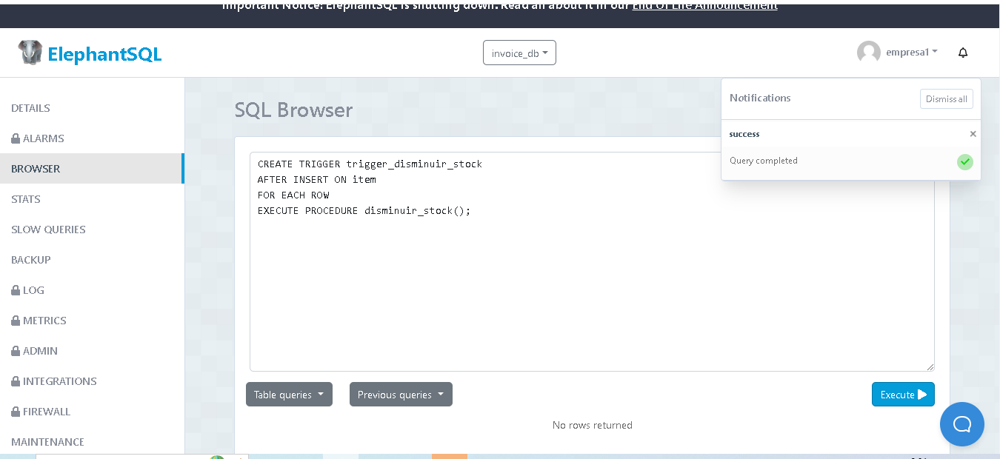
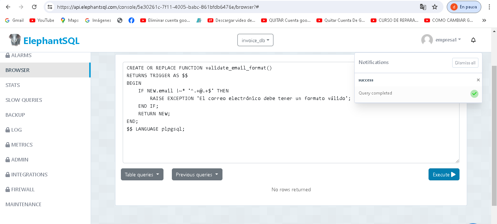
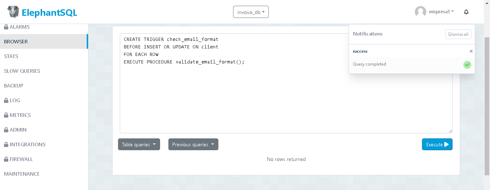

 1.-Crear un función y un trigger para validar que el numero de cedula del cliente tenga 10 números (no letras) en la tabla cliente.
          DELIMITER //

CREATE FUNCTION validate_nui(nui VARCHAR(10)) RETURNS BOOLEAN
BEGIN
    DECLARE valid BOOLEAN;

    IF LENGTH(nui) = 10 AND nui REGEXP '^[0-9]+$' THEN
        SET valid = TRUE;
    ELSE
        SET valid = FALSE;
    END IF;

    RETURN valid;
END //

DELIMITER ;

FROM client c;
 EXTRACT(YEAR FROM CURRENT_DATE) THEN
        RAISE EXCEPTION 'La fecha de creación debe ser del año actual';
    END IF;
    RETURN NEW;
END;

<img src="" 

4.- Crear un función y un trigger para la tabla client y validar que el correo tenga un @.

CREATE OR REPLACE FUNCTION validate_email_format()
RETURNS TRIGGER AS $$
BEGIN
    IF NEW.email !~* '^.+@.+$' THEN
        RAISE EXCEPTION 'El correo electrónico debe tener un formato válido';
    END IF;
    RETURN NEW;
END;

CREATE TRIGGER check_email_format
BEFORE INSERT OR UPDATE ON client
FOR EACH ROW
EXECUTE PROCEDURE validate_email_format();
<img src="" 
<img src="!"

